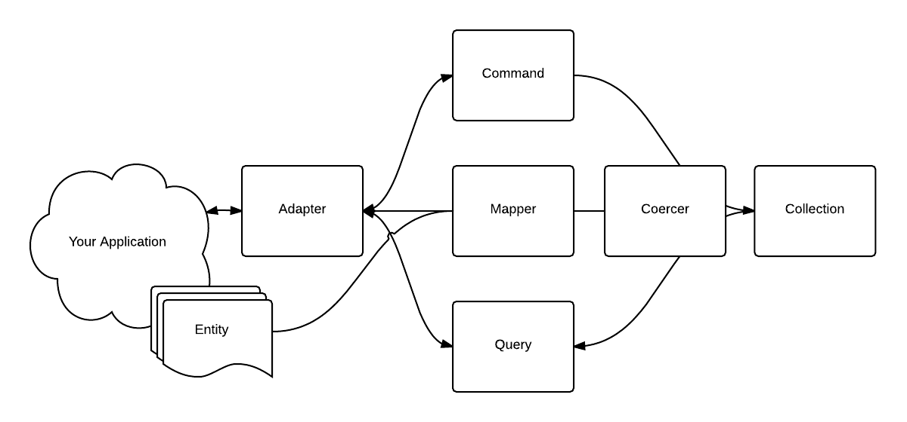

# Understanding Lotus::Model Adapters

Lotus::Model comes with two adapters: [SQL](https://github.com/lotus/model/blob/master/lib/lotus/model/adapters/sql_adapter.rb) and [Memory](https://github.com/lotus/model/blob/master/lib/lotus/model/adapters/memory_adapter.rb).

An Adapter collaborates with a [Mapper](https://github.com/lotus/model/blob/master/lib/lotus/model/mapper.rb).
The purpose of this collaboration is to define how:

* an in-memory entity is coerced to persistence
* a persisted object is reified into an in-memory entity

The Mapper collaborates with a [Coercer](https://github.com/lotus/model/blob/master/lib/lotus/model/mapping/coercer.rb) that is responsible for transforming an object to and from the persistence format.

An adapter must implement the methods defined in [Lotus::Models::Adapters::Abstract](https://github.com/lotus/model/blob/master/lib/lotus/model/adapters/abstract.rb):

* #persist(collection, entity)
* #create(collection, entity)
* #update(collection, entity)
* #delete(collection, entity)
* #all(collection)
* #find(collection, id)
* #first(collection)
* #last(collection)
* #clear(collection)
* #command(query)
* #query(collection, &blk)

For the [SQL](https://github.com/lotus/model/blob/master/lib/lotus/model/adapters/sql_adapter.rb) and [Memory](https://github.com/lotus/model/blob/master/lib/lotus/model/adapters/memory_adapter.rb) adapter implementations, they each implements three collaborating classes:

* Collection - (see [Memory::Collection](https://github.com/lotus/model/blob/master/lib/lotus/model/adapters/memory/collection.rb) or [Sql::Collection](https://github.com/lotus/model/blob/master/lib/lotus/model/adapters/sql/collection.rb))
* Query - (see [Memory::Query](https://github.com/lotus/model/blob/master/lib/lotus/model/adapters/memory/query.rb) or [Sql::Query](https://github.com/lotus/model/blob/master/lib/lotus/model/adapters/sql/query.rb))
* Command - (see [Memory::Command](https://github.com/lotus/model/blob/master/lib/lotus/model/adapters/memory/command.rb) or [Sql::Command](https://github.com/lotus/model/blob/master/lib/lotus/model/adapters/sql/command.rb))

The Collection is the receiver of both Command and Query messages.

The Command/Collection relationship is responsible for transforming an application entity to a "record" in the persistence layer.

The Query/Collection relationship is responsible for retrieving, via an identifier, one or more persisted records and instantiating the corresponding application entities.
